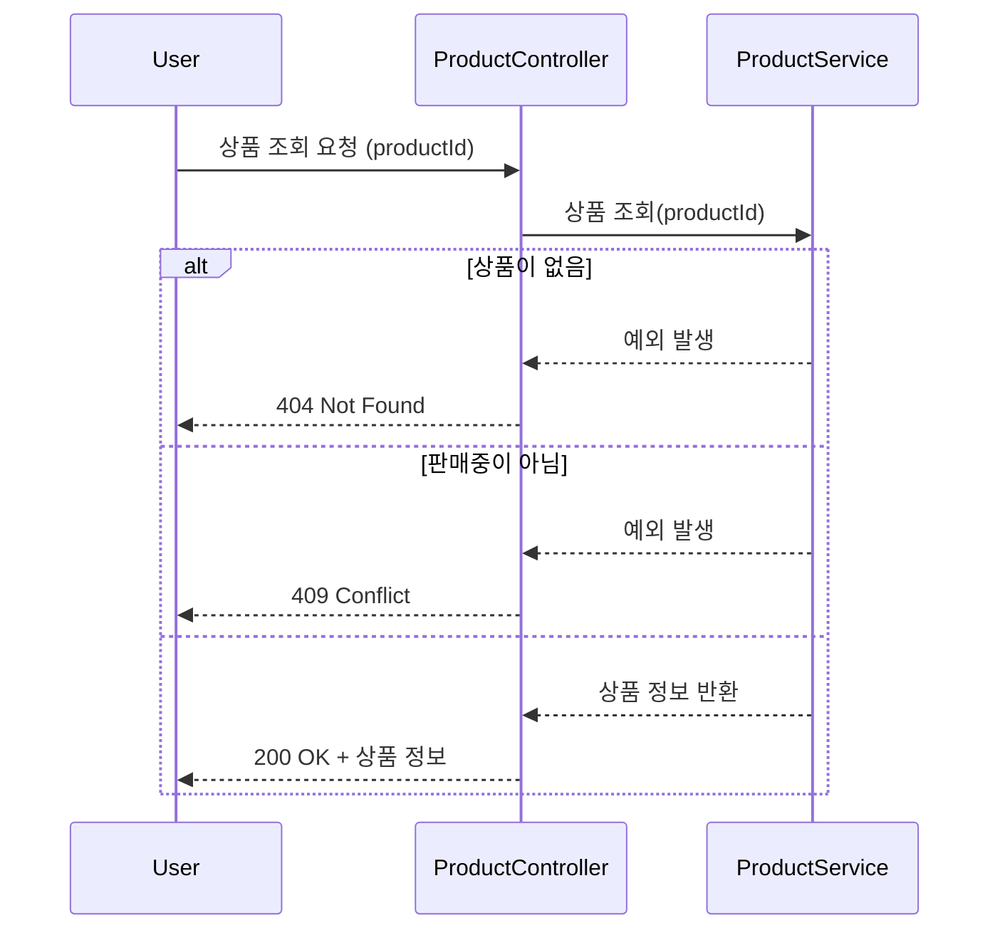
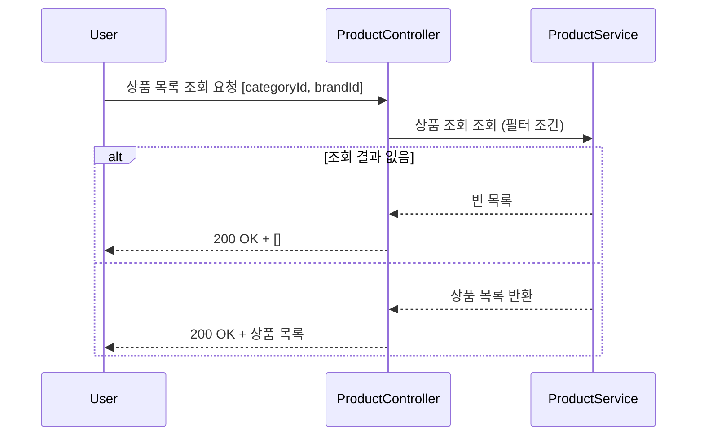
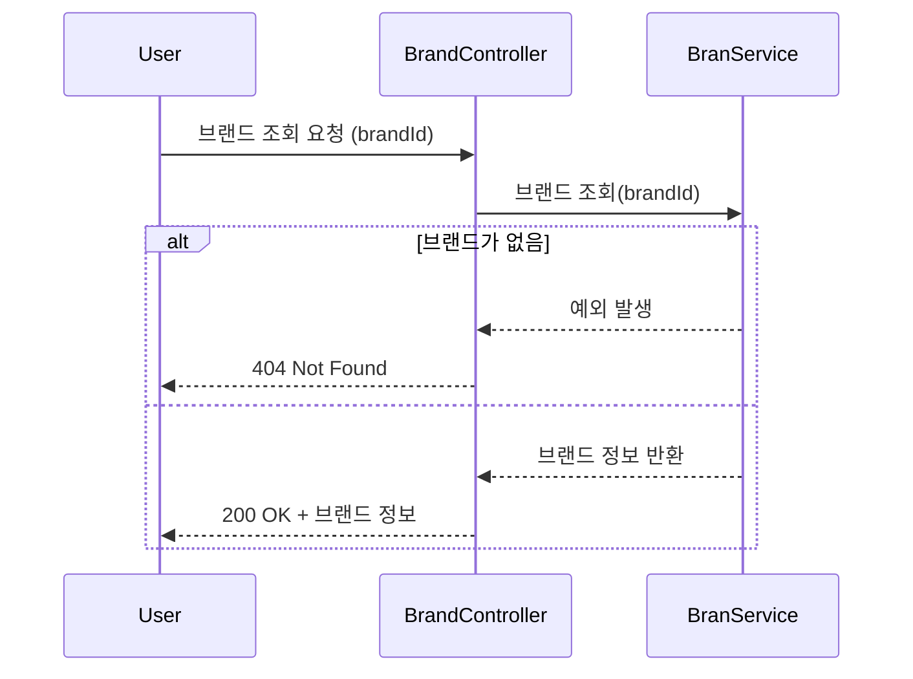
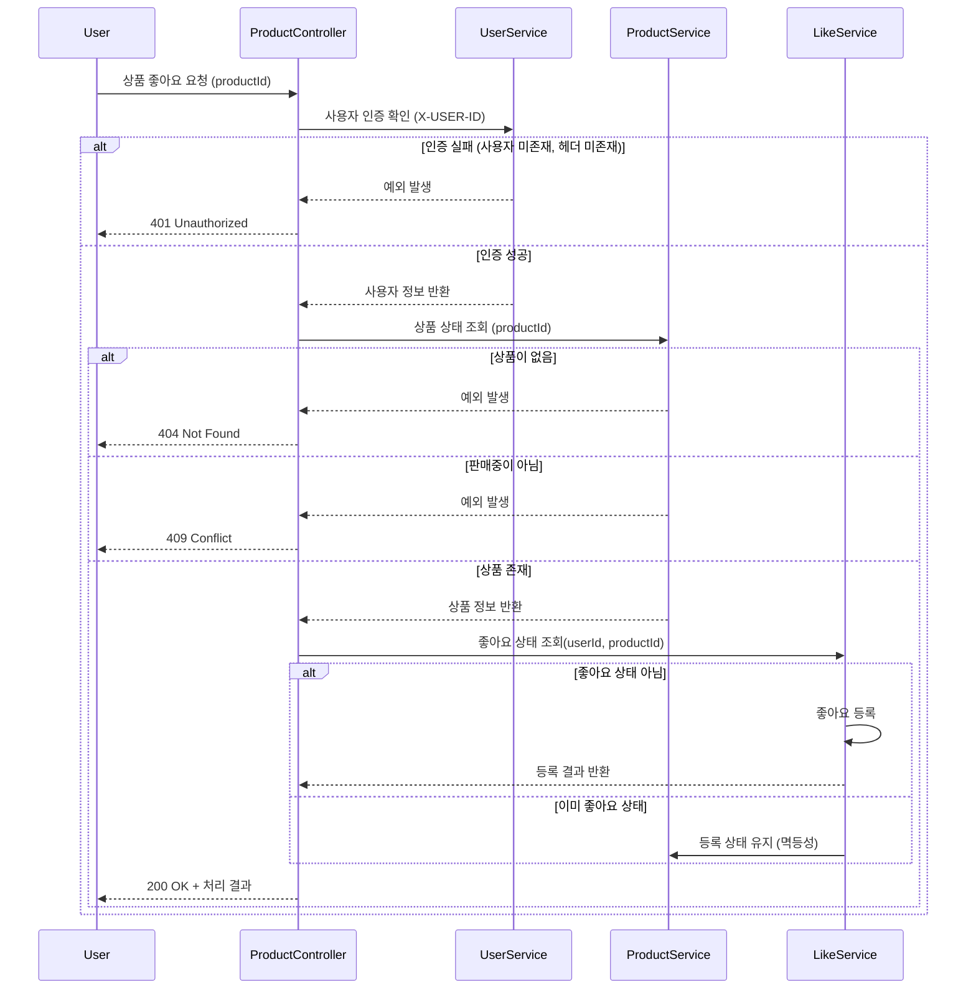
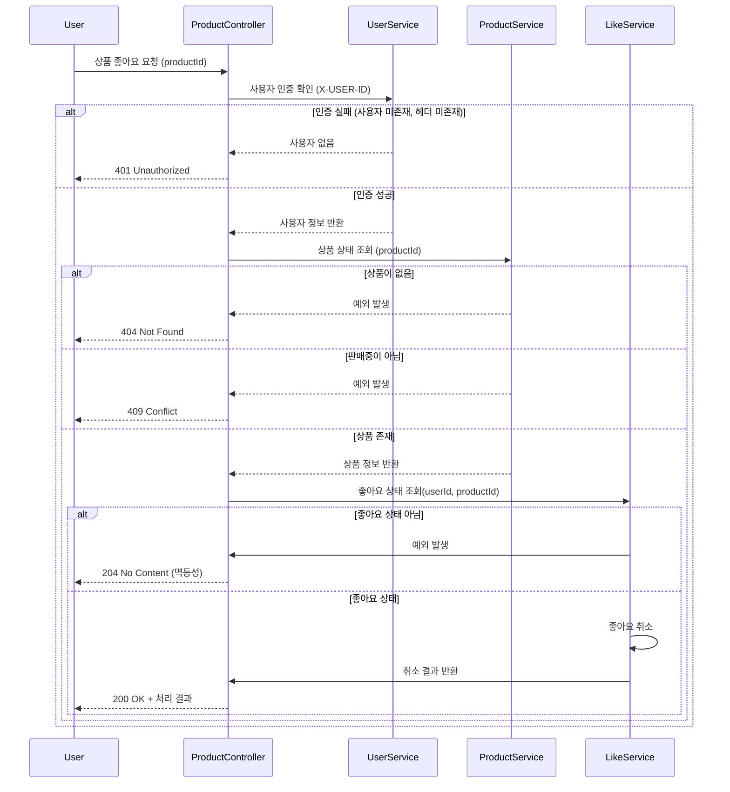
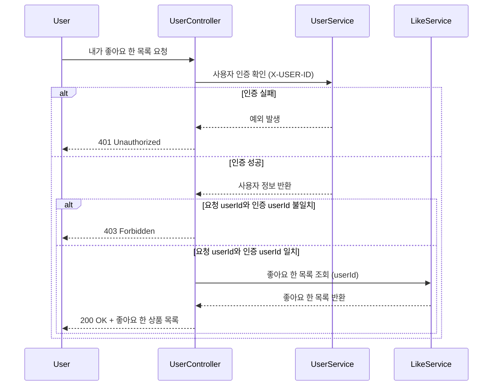
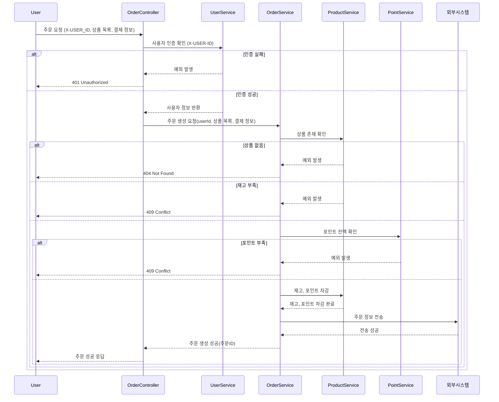
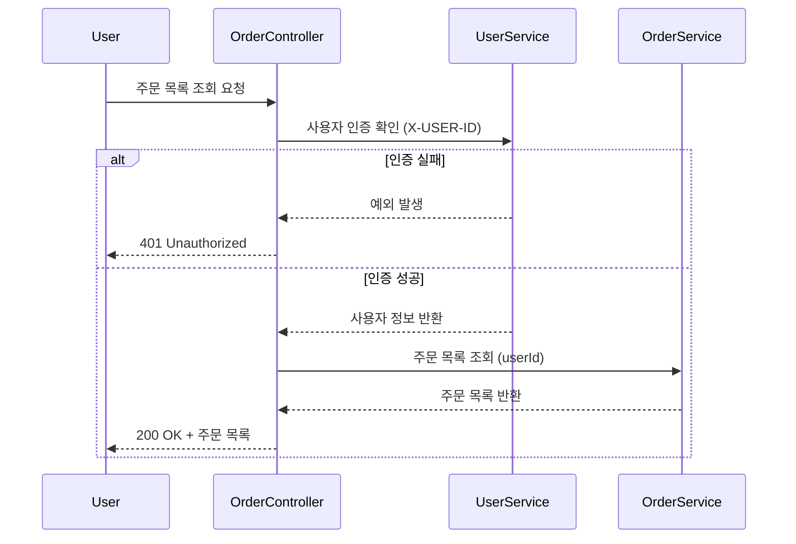
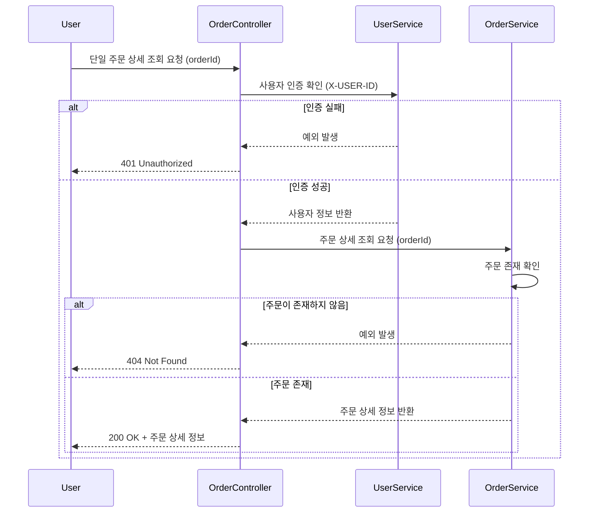

# E 커머스 서비스 시퀀스 다이어그램
## 상품
### 상품 상세조회 (/api/v1/products/{productId})

### 상품 목록 조회 (/api/v1/products)

## 브랜드
### 브랜드 상세 조회 (/api/v1/brands/{brandId})

## 좋아요
### 좋아요 등록 (/api/v1/products/{productId}/likes)

### 좋아요 취소 (/api/v1/products/{productId}/likes)

### 좋아요 조회 (/api/v1/users/{userId}/likes)

## 주문 및 결제
### 주문 요청 (/api/v1/orders)

### 유저의 주문 목록 조회 (/api/v1/orders)

### 단일 주문 상세 조회 (/api/v1/orders/{orderId})
