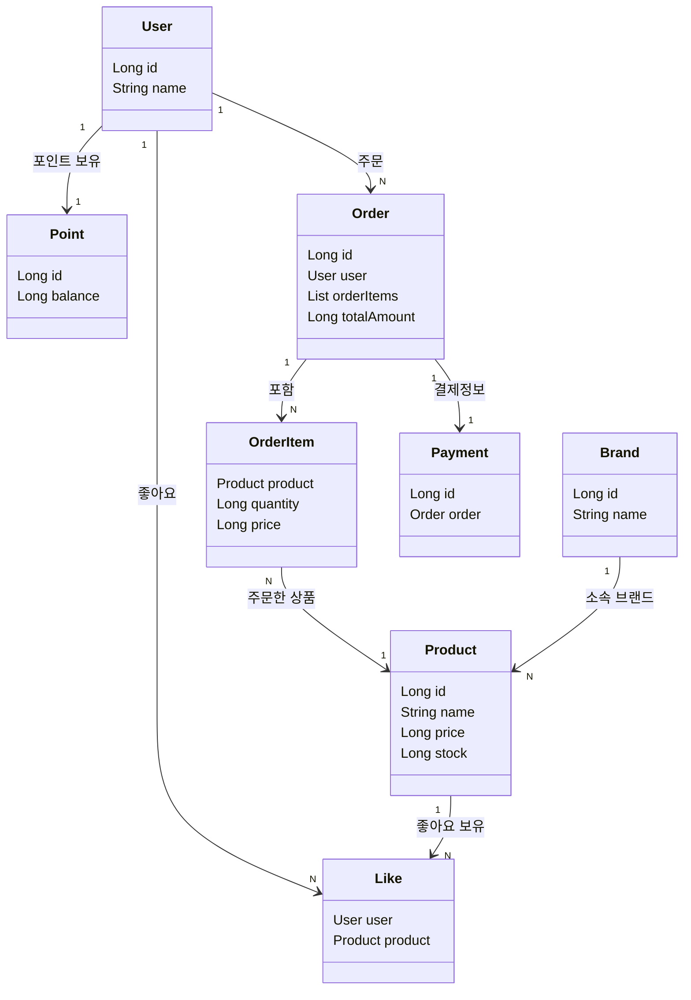

# E 커머스 서비스 클래스 다이어그램

```mermaid
classDiagram
    class User {
        Long id
        String name
    }
    class Point {
        Long id
        Long balance
    }
    class Product {
        Long id
        String name
        Long price
        Long stock
    }

    class Brand {
        Long id
        String name
    }

    class Like {
        User user
        Product product
    }

    class Order {
        Long id
        User user
        List orderItems
        Long totalAmount
    }

    class OrderItem{
        Product product
        Long quantity
        Long price
    }
    
    class Payment{
        Long id
        Order order
    }

    %% Associations
    User "1" --> "1" Point : 포인트 보유
    User "1" --> "N" Like : 좋아요
    Product "1" --> "N" Like : 좋아요 보유
    User "1" --> "N" Order : 주문
    Order "1" --> "N" OrderItem : 포함
    OrderItem "N" --> "1" Product : 주문한 상품
    Brand "1" --> "N" Product : 소속 브랜드
    Order "1" --> "1" Payment : 결제정보
```