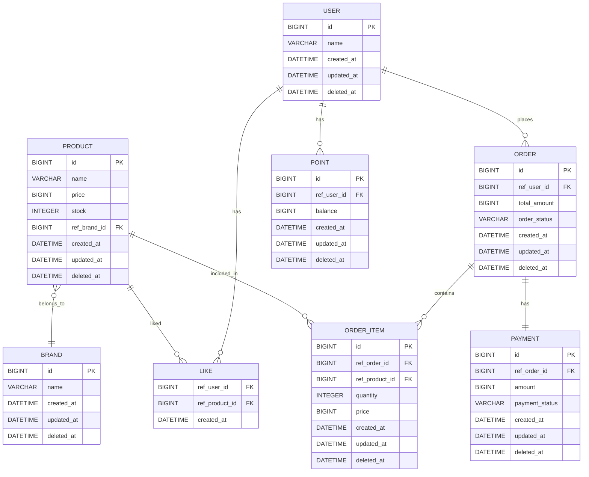

# E 커머스 서비스 ERD

```mermaid
erDiagram
    USER ||--o{ LIKE : has
    PRODUCT ||--o{ LIKE : liked
    PRODUCT }o--|| BRAND : belongs_to
    USER ||--o{ ORDER : places
    ORDER ||--o{ ORDER_ITEM : contains
    PRODUCT ||--o{ ORDER_ITEM : included_in
    ORDER ||--|| PAYMENT : has
    USER ||--o{ POINT : has

    USER {
        BIGINT id PK
        VARCHAR name
        DATETIME created_at
        DATETIME updated_at
        DATETIME deleted_at
    }

    POINT {
        BIGINT id PK
        BIGINT ref_user_id FK
        BIGINT balance
        DATETIME created_at
        DATETIME updated_at
        DATETIME deleted_at
    }

    PRODUCT {
        BIGINT id PK
        VARCHAR name
        BIGINT price
        INTEGER stock
        BIGINT ref_brand_id FK
        DATETIME created_at
        DATETIME updated_at
        DATETIME deleted_at
    }

    BRAND {
        BIGINT id PK
        VARCHAR name
        DATETIME created_at
        DATETIME updated_at
        DATETIME deleted_at
    }

    LIKE {
        BIGINT ref_user_id FK
        BIGINT ref_product_id FK
        DATETIME created_at
    }

    ORDER {
        BIGINT id PK
        BIGINT ref_user_id FK
        BIGINT total_amount
        VARCHAR order_status
        DATETIME created_at
        DATETIME updated_at
        DATETIME deleted_at
    }

    ORDER_ITEM {
        BIGINT id PK
        BIGINT ref_order_id FK
        BIGINT ref_product_id FK
        INTEGER quantity
        BIGINT price
        DATETIME created_at
        DATETIME updated_at
        DATETIME deleted_at
        
    }
    PAYMENT {
        BIGINT id PK
        BIGINT ref_order_id FK
        BIGINT amount
        VARCHAR payment_status
        DATETIME created_at
        DATETIME updated_at
        DATETIME deleted_at
    }
```