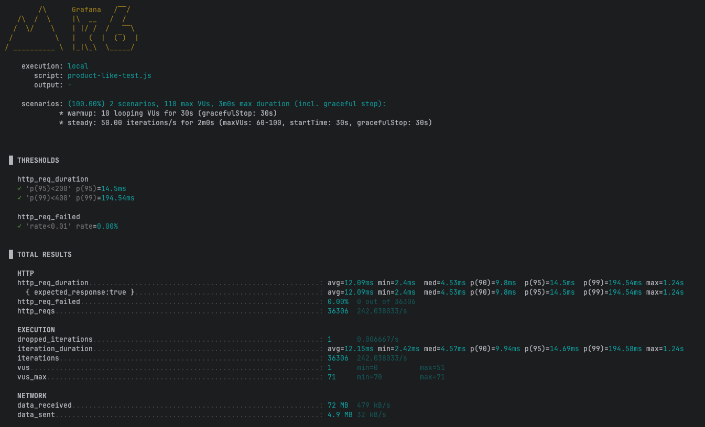
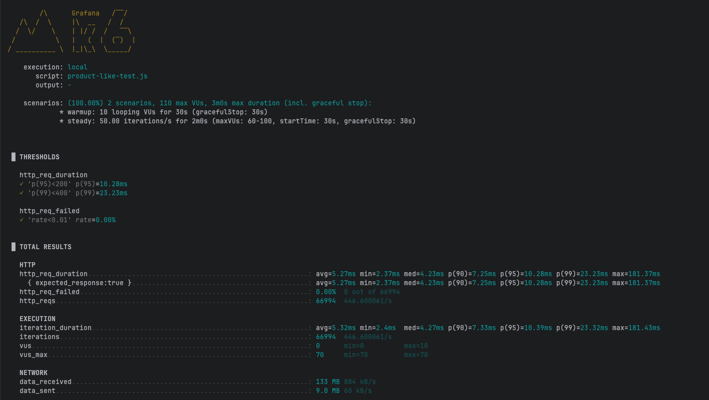

# 캐시를 이용한 성능 개선

## 캐시 적용 전



## 캐시 적용 후
```java
    @Transactional(readOnly = true)
    @Cacheable(
            cacheNames = RedisConfig.PRODUCT_LIST,
            cacheManager = RedisConfig.CACHE_MANAGER_MASTER,
            keyGenerator = "productListKeyGen",
            sync = true
    )
    public Page<ProductEntity> searchProducts(ProductQueryCommand.SearchProducts command) {
        return productQueryRepository.searchProducts(command);
}
```



## 결과 
| 지표                          |     캐시 전 |         캐시 후 |         변화 |
| --------------------------- | -------: | -----------: | ---------: |
| **RPS (http\_reqs/s)**      | 242.04/s | **446.60/s** | **+84.5%** |
| **평균 지연 (avg)**             |  12.09ms |   **5.27ms** | **-56.4%** |
| **중간값 (median)**            |   4.53ms |   **4.23ms** |  **-6.6%** |
| **p90**                     |   9.80ms |   **7.25ms** | **-26.0%** |
| **p95**                     |  14.50ms |  **10.28ms** | **-29.1%** |
| **p99**                     | 194.54ms |  **23.23ms** | **-88.1%** |
| **최대 지연 (max)**             |    1.24s | **181.37ms** | **-85.4%** |
| **에러율 (http\_req\_failed)** |    0.00% |    **0.00%** |          — |


