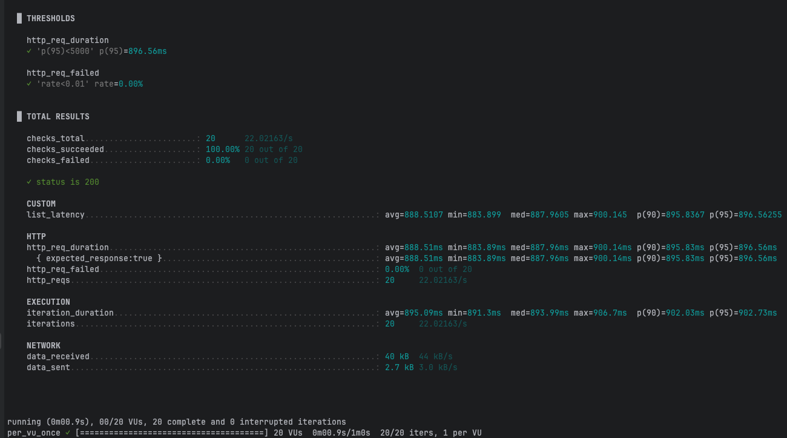

# 비정규화를 이용한 성능 개선

## 비정규화 적용 전


**쿼리**
```sql
SELECT  p.id, p.name, p.price, p.brand_id,
        COALESCE(cnt.c, 0) AS like_count
FROM products p
         LEFT JOIN (
    SELECT product_id, COUNT(*) AS c스
    GROUP BY product_id
) cnt ON cnt.product_id = p.id
WHERE p.brand_id = 42        
ORDER BY like_count DESC, p.id DESC
    LIMIT 20 OFFSET 0;
```
**실행 계획**
```
-> Limit: 20 row(s)  (actual time=0.952..0.955 rows=20 loops=1)
    -> Sort: like_count DESC, p.id DESC, limit input to 20 row(s) per chunk  (actual time=0.952..0.953 rows=20 loops=1)
        -> Stream results  (cost=36.40 rows=104) (actual time=0.640..0.912 rows=104 loops=1)
            -> Index lookup on p using idx_prod_brand_id (brand_id=42)  (cost=36.40 rows=104) (actual time=0.616..0.654 rows=104 loops=1)
-> Select #2 (subquery in projection; dependent)
    -> Aggregate: count(0)  (cost=0.45 rows=1) (actual time=0.002..0.002 rows=1 loops=104)
        -> Covering index lookup on l using idx_like_pid (product_id=p.id)  (cost=0.35 rows=1) (actual time=0.001..0.001 rows=0 loops=104)
```


## 비정규화 적용 후

```sql
SELECT  p.id, p.name, p.price, p.brand_id, p.like_count
FROM products p
WHERE p.brand_id = 42
ORDER BY p.like_count DESC, p.id DESC
LIMIT 20 OFFSET 0;
```
```java
    @Column(name = "like_count", nullable = false)
    private long likeCount;
```

**실행 계획**
```
-> Limit: 20 row(s)  (cost=36.40 rows=20) (actual time=0.826..0.833 rows=20 loops=1)
    -> Sort: p.like_count DESC, p.id DESC, limit input to 20 row(s) per chunk  (cost=36.40 rows=104) (actual time=0.825..0.829 rows=20 loops=1)
        -> Index lookup on p using idx_prod_brand_id (brand_id=42)  (actual time=0.137..0.705 rows=104 loops=1)
```
**실행 계획 분석**
- 실행결과 요약
  * 전체 소요시간: ~0.83 ms (Limit 20까지)
  * 플랜 흐름
      * Index Lookup: products에서 idx_prod_brand_id (brand_id=42)로 rows=104 조회
          * actual=0.137..0.705 ms
      * Sort: ORDER BY p.like_count DESC, p.id DESC (Chunk sort)
          * 입력 104행 → 출력 20행, actual=0.825..0.829 ms
      * Limit: 20행 반환, 최종 actual=0.826..0.833 ms
  * 특징: like_count 비정규화로 조인/집계/의존 서브쿼리 없음 → 단일 테이블 경로로 매우 가벼움 (참고: 인덱스 적용 전 ~74.74 ms 대비 약 90× 개선)

- 문제점
  * 정렬 단계 유지: like_count 정렬로 여전히 파일 정렬(Chunk sort) 수행
      * 후보 행(브랜드 내 상품 수)이 커지면 정렬 비용 증가
      * (해결책: products(brand_id, like_count DESC, id DESC) 복합 인덱스로 정렬 제거 가능)
  * 큰 OFFSET의 비효율: OFFSET이 큰 페이지에서는 스킵 비용 증가
      * (대안: 키셋/커서 페이지네이션)
  * 비정규화 유지 비용: like_count 갱신 시 쓰기 비용/정합성 관리 필요
      * 동시성(증가/감소) 처리, 재계산 배치/트리거, 장애 시 복구 전략 등 고려
  * 브랜드 쏠림(후보 많음) 시 비용 증가 가능:
      * idx_prod_brand_id만으로는 정렬을 못 없애므로, 브랜드 내 상품 수가 큰 경우 정렬·I/O가 증가
      * (필요 시 정렬용 복합 인덱스 또는 “커버링 인덱스” 구성 검토)

  




### 결과
| 단계 | 쿼리 방식 | 사용 인덱스(핵심) | EXPLAIN 핵심 | k6 p95 |
| --- | --- | --- | --- | --- |
| A. 인덱스 전 | 브랜드 필터 + **조인/집계 정렬** | (없음) | **Table scan** + temp/filesort | **3.53 s** |
| B. 인덱스 후 | 브랜드 필터 + **조인/집계 정렬** | `products(brand_id, id)`, `likes(product_id)` | **Index lookup** + 집계 | **0.90 s** |
| C. 비정규화 후 | 브랜드 필터 + **like_count 정렬 (조인 없음)** | (지금 플랜) `products(brand_id, id)` → Top-N 정렬 | **Index lookup** + Top-N sort | **0.131 s** |

