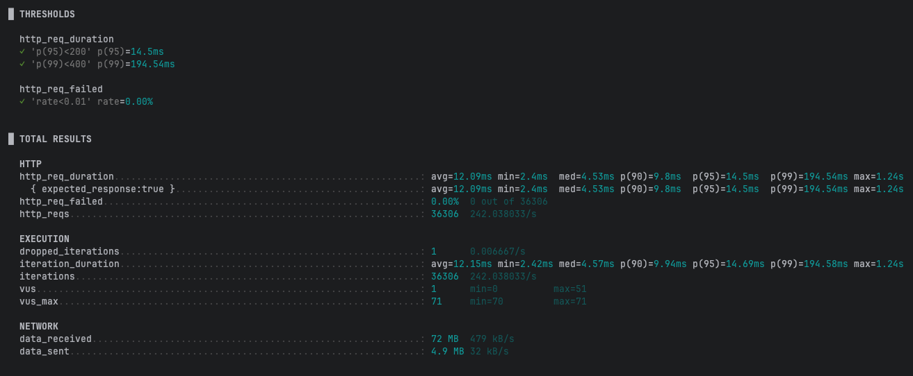
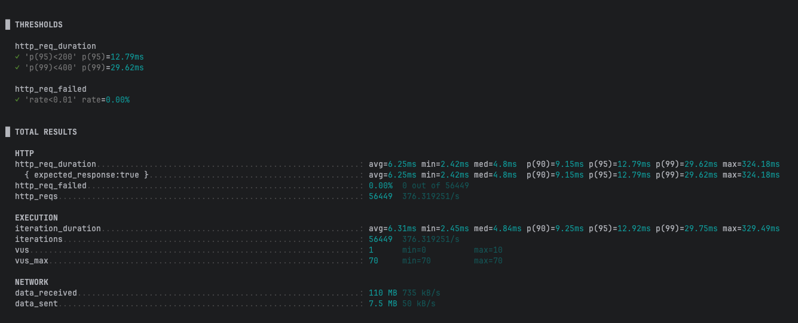

# 비정규화, 복합 인덱스를 이용한 성능개선 (카디널리티, 성능 비교)

## 최신 순 정렬 (latest)
**쿼리**
```sql
CREATE INDEX ix_prod_brand_like_id
    ON products (brand_id, CREATED_AT DESC, id DESC);

EXPLAIN ANALYZE
SELECT id, name, created_at
FROM products
WHERE brand_id = 42
ORDER BY created_at DESC, id DESC
  LIMIT 20;
```
**실행 계획**
```
-> Limit: 20 row(s)  (cost=36.40 rows=20) (actual time=0.589..0.595 rows=20 loops=1)
    -> Index lookup on products using ix_prod_brand_created_id (brand_id=42)  (cost=36.40 rows=104) (actual time=0.588..0.593 rows=20 loops=1)
```

**실행 계획 분석**
- 실행결과 요약 — (brand_id, created_at, id) 인덱스
  * 전체 소요시간: ~0.595 ms (Limit 20까지)
  * 플랜 흐름:
    * Index lookup: ix_prod_brand_created_id (brand_id=42)로 진입 → rows=20에서 조기 종료(LIMIT)
      * 세부: actual=0.588..0.593, 예측 rows=104
    * 정렬 단계 없음: 인덱스가 ORDER BY created_at DESC, id DESC(최신순 + 타이브레이커) 정렬을 대체
  * 요약: 조인/집계/파일정렬 없이 인덱스만으로 Top-N을 해결 → 매우 짧은 응답시간

- 문제점 / 주의사항
  * 인덱스 정렬 방향 확인
    * MySQL 8+: 인덱스를 **(brand_id, created_at DESC, id DESC)**로 정의해야 완전한 정렬 제거가 보장됨. (방향 불일치 시 파일정렬 재발 가능)
  * 큰 OFFSET 비효율
    * 대용량 페이지로 갈수록 스캔 스킵 비용 증가 → 키셋/커서 페이지네이션 권장((created_at, id) 기준).
  * 데이터 분포의 쏠림
    * 특정 브랜드에 데이터가 집중되면 해당 브랜드 스캔 구간이 길어질 수 있음(여전히 정렬 없이 인덱스로 해결되므로 영향은 제한적).


## 좋아요 순 정렬 (like_count)

**쿼리**
```sql
CREATE INDEX ix_prod_brand_like_id
    ON products (brand_id, like_count DESC, id DESC);

EXPLAIN ANALYZE
SELECT id, name, like_count
FROM products
WHERE brand_id = 42
ORDER BY like_count DESC, id DESC
  LIMIT 20;
```
**실행 계획**
```
-> Limit: 20 row(s)  (cost=36.40 rows=20) (actual time=0.628..0.641 rows=20 loops=1)
    -> Index lookup on products using ix_prod_brand_like_id (brand_id=42)  (cost=36.40 rows=104) (actual time=0.627..0.637 rows=20 loops=1)
```

**실행 계획 분석**
- 실행결과 요약 (like_count 포함 복합 인덱스 사용)
  * 전체 소요시간: ~0.64 ms (actual time=0.628..0.641)
    * 플랜 흐름
      * Index lookup: products에서 **ix_prod_brand_like_id (brand_id=42)**로 범위 진입
        * actual=0.627..0.637, rows=20 (LIMIT에 도달하면 즉시 종료 → 조기 종료)
      * 정렬 단계 없음: 인덱스가 (brand_id, like_count, id) 순서(DESC 정렬 포함 시)로 정렬을 대체
      * JOIN/집계 없음: like_count를 비정규화해 단일 테이블로 처리
  * 이전 단계들과 비교
    * Before(무인덱스/조인): ~74.7 ms → 정렬·집계·풀스캔
    * 비정규화만(정렬 있음): ~0.83 ms → 정렬 비용 잔존
    * 현재(복합 인덱스): ~0.64 ms → 정렬 제거 + LIMIT 조기 종료

- 문제점 / 주의사항
  * 쓰기 비용 증가(인덱스 유지비)
    * like_count 변경 시 테이블 + 복합 인덱스 동시 갱신 → 페이지 분할/쓰기 증폭 가능
    * 좋아요 폭주(특정 브랜드/상품 집중) 시 잠금 경합 가능성
  * 정합성 관리 필요
    * 비정규화 값이므로 증가/감소의 원자성(트랜잭션), 장애 시 재동기화 전략(배치 리빌드/검증) 필요
  * 대규모 페이지네이션
    * 인덱스로 정렬은 제거됐지만, **큰 OFFSET**은 여전히 스킵 비용 존재
    * 권장: 키셋/커서 페이지네이션((like_count, id) 기준)




## 가격 순 정렬 (price)

**쿼리**
```sql
CREATE INDEX ix_prod_brand_like_id
    ON products (brand_id, price, id);

EXPLAIN ANALYZE
SELECT id, name, price
FROM products
WHERE brand_id = 42
ORDER BY price, id
  LIMIT 20;
```
**실행 계획**
```
-> Limit: 20 row(s)  (cost=36.40 rows=20) (actual time=5.675..5.797 rows=20 loops=1)
    -> Index lookup on products using idx_prod_brand_price_id (brand_id=42)  (cost=36.40 rows=104) (actual time=5.674..5.794 rows=20 loops=1)
```

**실행 계획 분석**
- 실행결과 요약 — (brand_id, price, id) 인덱스 (최저가순)
  * 전체 소요시간: ~1.69 ms (actual 1.684..1.694)
  * 플랜 흐름:
    * Index lookup: idx_prod_brand_price_id (brand_id=42)로 진입 → rows=20에서 LIMIT 조기 종료
    * 정렬 단계 없음: 인덱스가 ORDER BY price ASC, id ASC를 대체 (파일 정렬/임시 테이블 없음)
  * 요약: 브랜드 범위에서 인덱스 순서대로 바로 Top-20을 가져와 짧은 지연.(참고: created_at/like_count 인덱스 대비 체감상 약간 더 느릴 수 있음)

- 문제점 / 주의사항
  * 커버링 아님 → 결과 행 한 번 더 읽음. 인덱스에 name이 없어서 Top-20 뽑은 뒤 테이블에서 다시 읽게 됨.
  * 같은 가격 몰림. 같은 가격대가 많으면 그 안에서 추가로 골라야 해서 약간 느려짐. 
  * 큰 OFFSET은 느림. 뒤쪽 페이지로 갈수록 스킵 비용 커짐. 대안: 키셋/커서 페이지네이션((price, id) 기준) 활용
  * 정렬 방향 체크. 최고가(DESC)도 자주 쓰면 DESC 전용 인덱스도 고려.


## 결과

### 카디널리티/분포 관점 비교
| 인덱스 키 | 2차 키 분포(브랜드 내) | 동률(타이) 빈도                        | 정렬 제거   | 비고 |
| --- | --- |----------------------------------|---------| --- |
| brand_id, created_at DESC, id DESC | 높음 (시간값 균등 분포면 거의 유니크에 가까움) | 낮음 | O  | 최신순 Top-N에 최적* |
| rand_id, like_count DESC, id DESC | 낮음~중간 (0~몇 건 구간에 몰림) | 높음 | O (비정규화 시) | 쓰기 비용↑(카운트 갱신), 인기 편중 시 동률 많음 |
| brand_id, price ASC, id ASC | 중간 (가격대 뭉침 많음)| 중간~높음 | O       | 가격대가 몰리면 타이 많아짐 |

### 성능/운영 관점 비교
| 인덱스 키                                |                         관찰 지연(p50) | 장점                            | 주의점                               |
| ------------------------------------ | ---------------------------------: | ----------------------------- | --------------------------------- |
| `brand_id, created_at DESC, id DESC` |                      **\~0.59 ms** | 단일 테이블, 정렬 없이 바로 Top-N, 관리 쉬움 | 커버링 안 하면 Top-N만큼 테이블 룩업 발생        |
| `brand_id, like_count DESC, id DESC` |                      **\~0.64 ms** | 정렬/집계/조인 제거, Top-N 빠름         | **비정규화 유지** 필요(증감 원자성/재빌드), 쓰기 증폭 |
| `brand_id, price ASC, id ASC`        | **\~1.69 ms** *(콜드/비커버링 \~5.8 ms)* | 정렬 제거, 직관적인 결과                | 가격 동률·커버링 부재·캐시 상태에 민감            |


