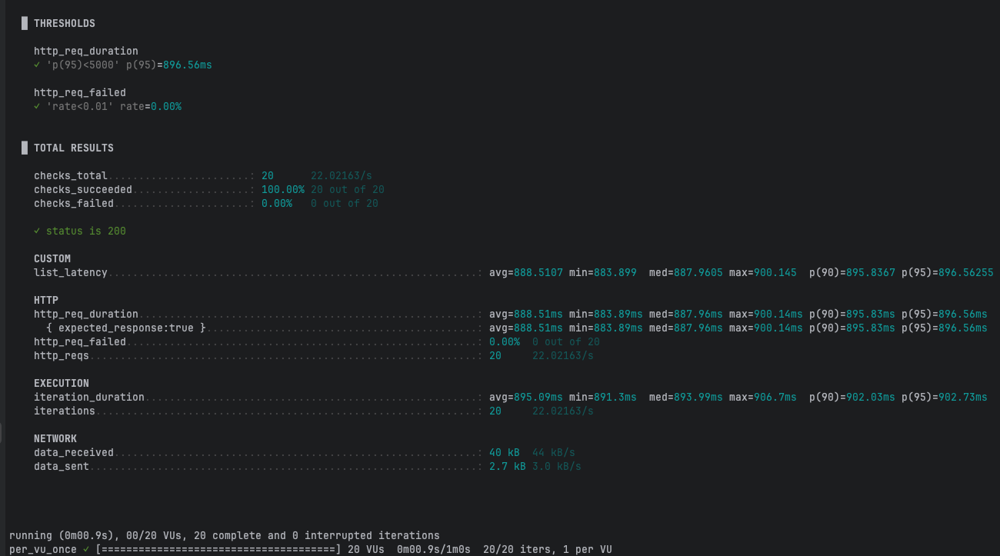

# 인덱스를 이용한 성능 개선

## 인덱스 적용 전
**쿼리**
```sql
SELECT  p.id, p.name, p.price, p.brand_id,
        COALESCE(cnt.c, 0) AS like_count
FROM products p
         LEFT JOIN (
    SELECT product_id, COUNT(*) AS c스
    GROUP BY product_id
) cnt ON cnt.product_id = p.id
WHERE p.brand_id = 42        
ORDER BY like_count DESC, p.id DESC
    LIMIT 20 OFFSET 0;
```

**실행 계획**

```
> Limit: 20 row(s)  (actual time=74.738..74.740 rows=20 loops=1)
    -> Sort: like_count DESC, p.id DESC, limit input to 20 row(s) per chunk  (actual time=74.737..74.738 rows=20 loops=1)
        -> Stream results  (cost=105.32 rows=0) (actual time=1.921..74.535 rows=104 loops=1)
            -> Left hash join (cnt.product_id = p.id)  (cost=105.32 rows=0) (actual time=1.912..74.262 rows=104 loops=1)
                -> Filter: (p.brand_id = 42)  (cost=10468.92 rows=9945) (actual time=0.740..73.025 rows=104 loops=1)
                    -> Table scan on p  (cost=10468.92 rows=99450) (actual time=0.631..68.198 rows=100000 loops=1)
                -> Hash
                    -> Table scan on cnt  (cost=2.50..2.50 rows=0) (actual time=1.074..1.074 rows=0 loops=1)
                        -> Materialize  (cost=0.00..0.00 rows=0) (actual time=1.074..1.074 rows=0 loops=1)
                            -> Table scan on <temporary>  (actual time=0.956..0.956 rows=0 loops=1)
                                -> Aggregate using temporary table  (actual time=0.955..0.955 rows=0 loops=1)
                                    -> Covering index scan on likes using uk_like_user_product  (cost=0.35 rows=1) (actual time=0.945..0.945 rows=0 loops=1)

```

**실행 계획 분석**
* 실행결과 요약
  * 전체 소요시간: ~74.74 ms
  * 처리 흐름:
      * products: Table scan → brand_id = 42 필터
          * 스캔 100,000행 → 사용 104행, 소요 ~68–73 ms (지배적)
      * likes: GROUP BY product_id → 임시 테이블(Materialize) → 해시 빌드
          * 현재 데이터 0행, 소요 ~0.95–1.07 ms
      * JOIN: LEFT HASH JOIN (cnt.product_id = p.id) → 104행
      * 정렬: like_count DESC, p.id DESC 대상 104행 → LIMIT 20
          * 정렬 비용 미미
* 문제점
  * products 풀 스캔이 병목
      * 필요한 104행만을 위해 10만 행 전수 읽기
      * 원인: brand_id 조건을 효율화할 인덱스 부재/미사용
  * 집계 단계 잠재 비용
      * 데이터 증가 시 임시 테이블/해시 조인 비용 급증
      * GROUP BY product_id에 선두가 product_id인 인덱스가 없으면 Using index for group-by 유도 어려움
  * 정렬의 구조적 한계
      * like_count가 조인 후 계산되는 값이라 인덱스만으로 정렬 제거 불가(반정규화 없이는)
  * 스케일 리스크
      * products 증가 → 풀 스캔 시간 선형 증가
      * likes 증가 → 집계/임시 테이블/해시 조인 비용이 새 병목으로 부상


## 인덱스 적용 후
```sql
CREATE INDEX idx_product_brand_id ON product(brand_id);
```

**실행 계획**
```
-> Limit: 20 row(s)  (actual time=0.952..0.955 rows=20 loops=1)
    -> Sort: like_count DESC, p.id DESC, limit input to 20 row(s) per chunk  (actual time=0.952..0.953 rows=20 loops=1)
        -> Stream results  (cost=36.40 rows=104) (actual time=0.640..0.912 rows=104 loops=1)
            -> Index lookup on p using idx_prod_brand_id (brand_id=42)  (cost=36.40 rows=104) (actual time=0.616..0.654 rows=104 loops=1)
-> Select #2 (subquery in projection; dependent)
    -> Aggregate: count(0)  (cost=0.45 rows=1) (actual time=0.002..0.002 rows=1 loops=104)
        -> Covering index lookup on l using idx_like_pid (product_id=p.id)  (cost=0.35 rows=1) (actual time=0.001..0.001 rows=0 loops=104)

```
**실행 계획 분석**
* 실행결과 요약
  * 전체 소요시간: ~0.955 ms (Before ~74.74 ms → 약 98.7% 감소, ~78.3배 개선)
  * 처리 흐름:
      * products: idx_prod_brand_id(brand_id[, id])로 Index lookup → rows=104, ~0.616–0.654 ms
      * likes: 프로젝션 내 **의존 서브쿼리(dependent subquery)**로 COUNT(*)
          * idx_like_pid(product_id) 커버링 인덱스로 104회 룩업(각 ~0.001–0.002 ms 수준)
          * 임시 테이블/해시 조인 없음
      * 정렬: like_count DESC, p.id DESC 대상 104행, LIMIT 20
          * 후보 행이 작아 정렬 비용 미미
  * 핵심 변화:
      * products 풀 스캔 제거 → 인덱스 범위/룩업로 전환
      * likes 집계-임시테이블-해시조인 제거 → 행당 커버링 인덱스 카운트로 대체

문제점
* N+1 패턴 잠재성(의존 서브쿼리):
    * 브랜드 필터 결과 행 수가 매우 커지면 likes에 대한 행당 인덱스 룩업 횟수가 증가(선형 증가).
    * 현재는 커버링 인덱스로 저렴하지만, 후보 행 수 증가 시 총 비용 상승 가능.
  * 정렬 유지:
      * like_count가 런타임 계산값이라 인덱스로 정렬 제거 어려움.
      * 후보 행이 많아지면 정렬 비용 증가 가능. (해결책: products.like_count 반정규화 + (brand_id, like_count DESC, id DESC) 복합 인덱스 검토)
  * 인덱스 의존성:
      * idx_like_pid(product_id)가 없어지면 그룹화/카운트 비용 급증 및 임시 테이블 회귀 위험.
  * 대규모 페이지네이션 시 리스크:
      * (향후) OFFSET이 커지는 페이지는 후보 행 스킵 비용 증가. (커서 기반/키셋 페이지네이션 고려)





### 결과
| 항목 | 인덱스 전 | 인덱스 후 | 변화 |
| --- | --- | --- | --- |
| p95 (http_req_duration) | **3.53 s** | **0.897 s** | **−74.7%** |
| 평균 (http_req_duration) | 3.53 s | 0.889 s | −74.8% |
| 성공률 (http_req_failed) | 0% (전부 성공) | 0% (전부 성공) | 동일 |
| 처리량 (http_reqs/s) | 5.64 req/s | 22.02 req/s | **≈ 3.9× ↑** |

